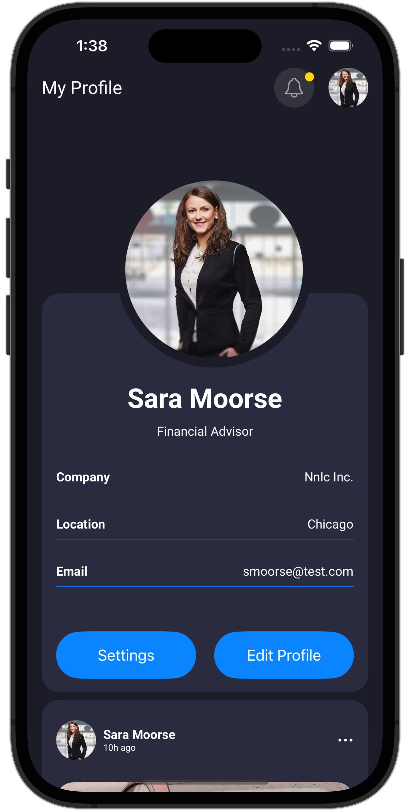

# StockLift Hiring Project

## Requirements:

- [x] SwiftUI 
- [x] Minimum Deployment 14
- [ ] Follow the Design to exact details: `Lacking the necessary access permissions to review UI dimension information in InVision.`
- [x] Please build out the Network Layer & Folder structure as if this was a full scale app
- [x]No Enviornment Objects please (too buggy in full scale, a better solution is UserDefaults)

### Screenshots

|  |  |  |
| - | - | - |
| inVision | iPhone 15 | Video |
|  |  |    |

### Code Explain

1. The project utilizes the MVVM architecture.

2. Use `dateDecodingStrategy` and `keyDecodingStrategy` for JSON decoding.

3. I prefer using Async/Await, which I find more readable than Combine.

4. I spent about 7-8 hours on this project. It appears there are no specific news feed UI designs in InVision. And if I have more time, I will finish the feed UI.